<h1 align="center">Inventory Manager</h1>

<p align="center">
  Offline warehouse & inventory management system for Windows
</p>

<p align="center">
  
  
  
  
  
</p>

---

## Overview

A production-grade, self-contained desktop application for warehouse operations. Runs **entirely offline** on Windows with zero internet, server, or cloud dependencies. All data lives in a local SQLite database.

- Portable — copy a folder and double-click to run, no installation needed
- Atomic stock engine — every change is transactional, oversell is rejected
- Full audit trail — every action logged with user and timestamp
- Role-based access — 4 built-in roles with granular permissions
- Professional PDF reports — branded, styled, ready for print

---

## Screenshots

| Login | Dashboard | Products | Purchases |
|:---:|:---:|:---:|:---:|
| 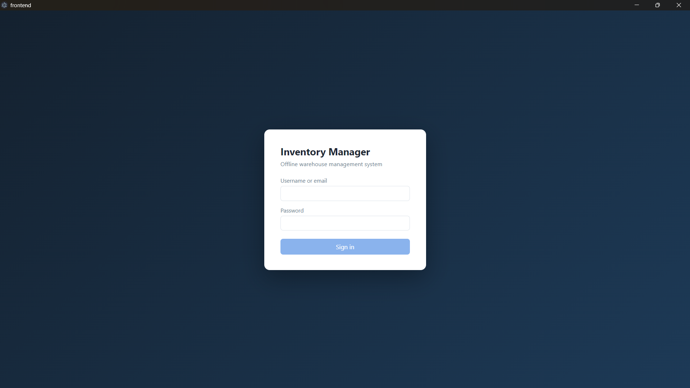 | 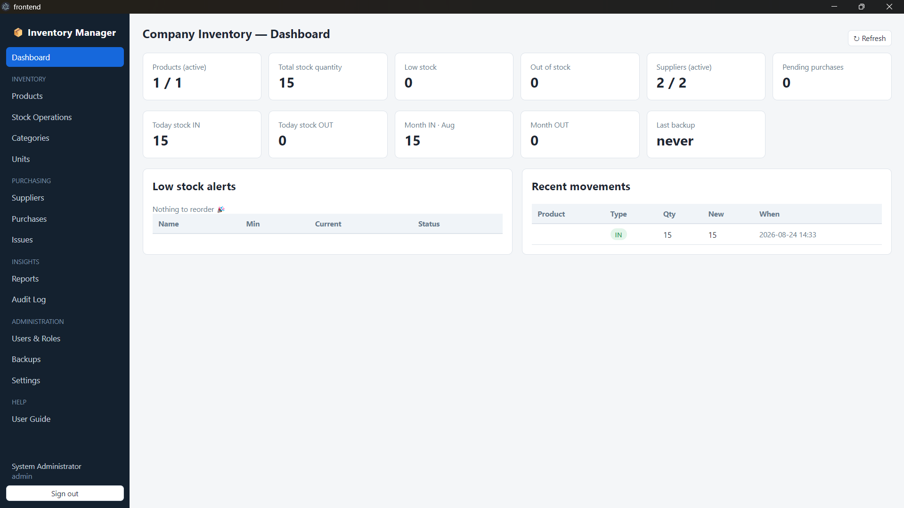 | 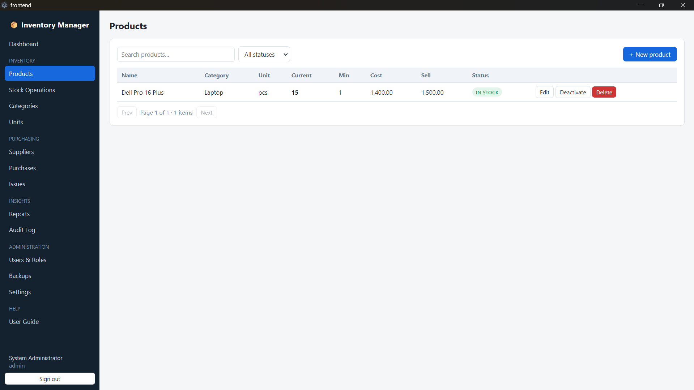 | 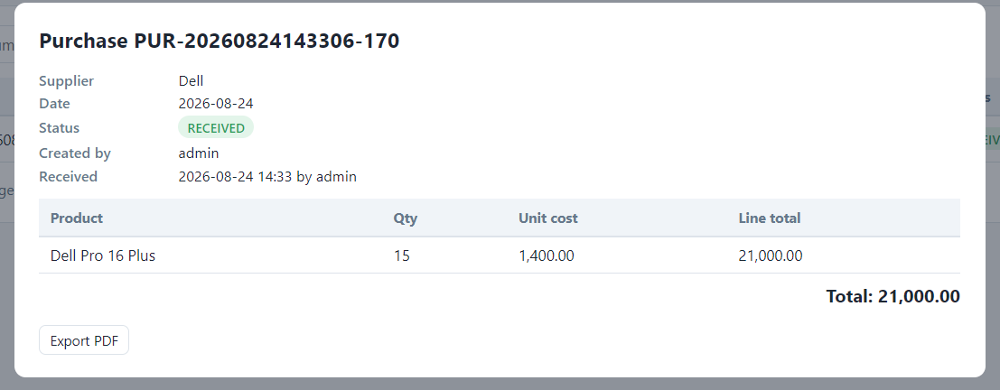 |

| Reports | Settings | Stock | Users |
|:---:|:---:|:---:|:---:|
| 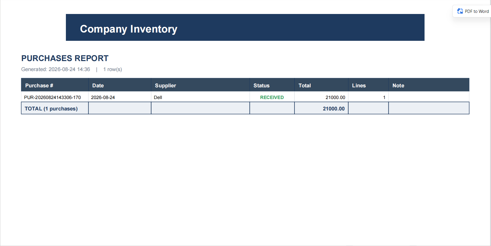 | 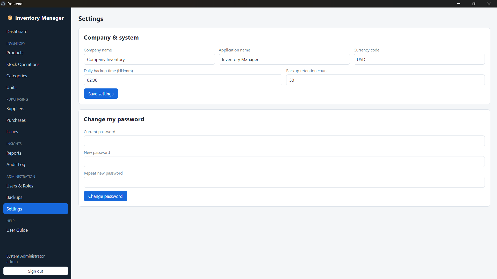 | 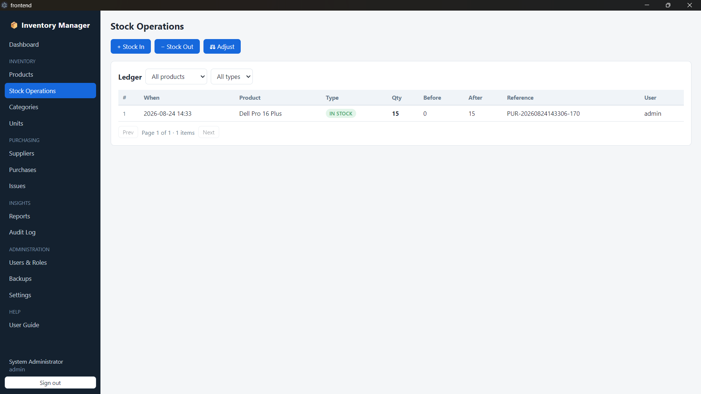 | 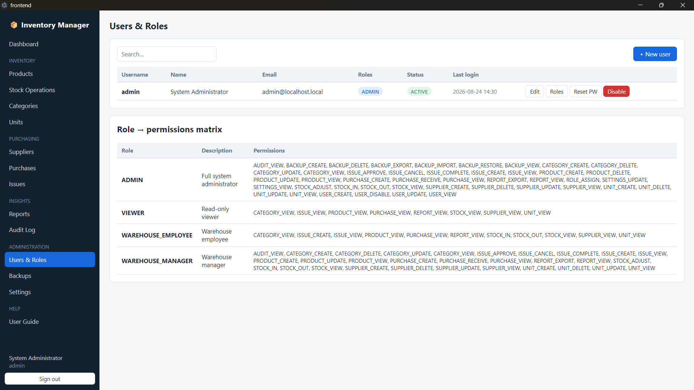 |

---

## Architecture

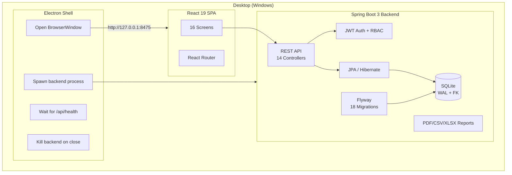

### Request Flow

```mermaid
sequenceDiagram
    participant C as Browser (Electron)
    participant A as JwtAuthFilter
    participant P as Controller
    participant S as Service
    participant R as Repository
    participant D as SQLite

    C->>A: GET /api/products<br/>Authorization: Bearer eyJ...
    A->>A: Validate token, load user
    A->>P: Forward with SecurityContext
    P->>S: getProducts(filter, page)
    S->>R: findBySpec(spec, pageable)
    R->>D: SELECT * FROM products...
    D-->>R: ResultSet
    R-->>S: Page&lt;Product&gt;
    S-->>P: PageResponse DTO
    P-->>C: 200 OK + JSON
```

---

## Tech Stack

| Layer | Technology | Version |
|-------|-----------|---------|
| Language | Java | 21 |
| Backend | Spring Boot | 3.3.4 |
| Database | SQLite | 3.46.1.3 |
| Schema Migrations | Flyway | 10.10.0 |
| Authentication | JWT (jjwt) | 0.12.6 |
| PDF Generation | OpenPDF | 1.3.43 |
| Excel Export | Apache POI | 5.3.0 |
| Frontend | React | 19.2.8 |
| Build Tool (FE) | Vite | 8.2.0 |
| Desktop Shell | Electron | Latest |

---

## Features

### Dashboard

Real-time overview of warehouse operations:

- **KPI cards** — total products, low-stock alerts, today's movements, pending purchases
- **7-day movement chart** — stock in vs. stock out trend
- **Category breakdown** — stock value distribution
- **Low stock alerts** — products below minimum threshold
- **Backup health** — last backup status, database size
- **Company name** — pulled from Settings, displayed in header
- **Refresh button** — instant data reload

### Product Catalog

Full product management with:

- Name, category, unit, supplier
- Cost price & selling price (stored as integer cents for precision)
- Minimum stock threshold (triggers low-stock alerts)
- Opening quantity on creation
- **Permanent delete** with history check — blocked if stock movements exist
- Search, filter by category/supplier, pagination

### Stock Management

Atomic stock engine with:

- **Stock In** — add inventory with supplier reference and notes
- **Stock Out** — remove inventory with reason tracking
- **Adjustments** — reconcile physical counts
- **Full movement ledger** — every change recorded with type, quantity, running balance
- **Oversell protection** — concurrent withdrawals are serialized; insufficient stock is rejected with rollback
- **Stock snapshots** — current stock levels per product

### Purchases

Purchase order workflow:

- **PENDING** → **RECEIVED** → (terminal)
- Receiving a purchase **atomically increases stock** for each line item
- **Cancellation** while pending reverses any partial stock impact
- **Line items** with product, quantity, unit cost price
- **Total calculation** — sum of all line items
- **Export PDF** — professional purchase invoice with company header

### Issues

Goods issue workflow:

- **PENDING** → **APPROVED** → **COMPLETED** → (terminal)
- **Approval** by manager role
- **Completion** atomically deducts stock
- **Line items** with product, quantity
- Department/recipient tracking

### Reports & PDF Export

Seven report types, each with professional PDF generation:

| Report | Description |
|--------|-------------|
| **Inventory** | Full stock levels with values, sorted by product |
| **Low Stock** | Products below minimum threshold |
| **Stock Movements** | Complete movement history with type indicators |
| **Purchases** | All purchase orders with totals |
| **Issues** | All goods issues with totals |
| **Suppliers** | Supplier directory with contact info |
| **Audit Log** | System-wide change audit trail |

**PDF Report Features:**
- Company name header bar (configurable in Settings)
- Report title with generation date and row count
- Smart column widths (wider for names, narrower for numbers)
- Right-aligned currency and number columns
- Color-coded status badges (green/orange/red)
- Alternating row colors for readability
- Summary/total rows for Inventory (total stock value) and Purchases (total amount)
- Page numbers footer

**Export formats:** PDF, CSV, XLSX, JSON

### Users & Security

- **JWT authentication** — stateless, 30-minute session timeout
- **4 built-in roles:**

| Role | Permissions |
|------|------------|
| `ADMIN` | Everything, including users, settings, backup/restore |
| `WAREHOUSE_MANAGER` | Catalog, purchases, issues, reports, backups |
| `WAREHOUSE_EMPLOYEE` | Stock operations, drafts, view reports |
| `VIEWER` | Read-only access to all screens |

- **Password policy** — minimum 8 characters, complexity requirements
- **Account lockout** — configurable failed attempt threshold
- **BCrypt hashing** — passwords never stored in plaintext
- **Full audit log** — every API mutation recorded with user, action, entity, timestamp

### Backup & Restore

- **Manual backups** — create on-demand from the Backups screen
- **Automatic backups** — configurable schedule (default 02:00 daily, 30-day retention)
- **Backup format** — ZIP archive containing `inventory.db` + metadata JSON
- **Integrity verification** — checksum validation on backup files
- **Export/Import** — copy backups between machines via folder or zip
- **Live restore** — restore while the app is running:
  1. Verify integrity
  2. Check schema version compatibility
  3. Save a SAFETY backup
  4. Suspend HikariCP connections
  5. Swap the database file
  6. Resume connections
  7. All without restarting the app
- **Manual restore** — copy `inventory.db` into `data/` while app is closed, delete `-wal`/`-shm` files

### Settings & Branding

Configurable via the Settings screen (ADMIN role required):

| Setting | Description |
|---------|-------------|
| `app.name` | Application name (shown in sidebar) |
| `company.name` | Company name (shown in dashboard header, PDF reports) |
| `company.currency` | Currency code for reports |
| `backup.enabled` | Enable/disable automatic backups |
| `backup.time` | Daily backup time (HH:mm) |
| `backup.retention.count` | Number of automatic backups to keep |

---

## Getting Started

### Prerequisites

- **JDK 21+** (`JAVA_HOME` set)
- **Maven 3.9+**
- **Node.js 18+** and **npm**

### Development Mode

```bash
# Clone the repo
git clone https://github.com/YOUR_USERNAME/InventoryManager.git
cd InventoryManager

# Install frontend dependencies
cd frontend && npm install && cd ..

# Start backend (API + UI on http://127.0.0.1:8475)
cd backend && mvn spring-boot:run

# In another terminal, start frontend dev server (port 5173, proxies /api)
cd frontend && npm run dev
```

**Default credentials:**

| Field | Value |
|-------|-------|
| Username | `admin` |
| Password | `admin@omar.com` |

> Change the admin password after first login.

### Portable Build

```bash
# Install dependencies (one-time)
cd frontend && npm install && cd ..
cd desktop && npm install && cd ..

# Build portable package
powershell -ExecutionPolicy Bypass -File scripts\package-portable.ps1
```

Output: `dist\InventoryManager\` (~400MB)

```
dist\InventoryManager\
├── start.cmd              ← double-click to run
├── app\                   ← Electron shell
├── electron\              ← prebuilt Electron binaries
├── backend\
│   ├── inventory-backend.jar
│   ├── data\              ← SQLite DB (created on first run)
│   ├── backups\
│   ├── exports\
│   ├── logs\
│   └── config\            ← JWT secret, admin credentials
└── runtime\               ← jlink-trimmed JRE (~80MB)
```

**Target machine:** Windows 10/11, no Java/Node/npm needed.

---

## Project Structure

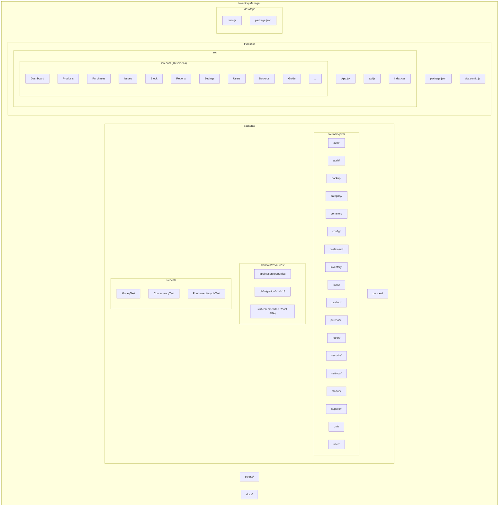

---

## Database Schema

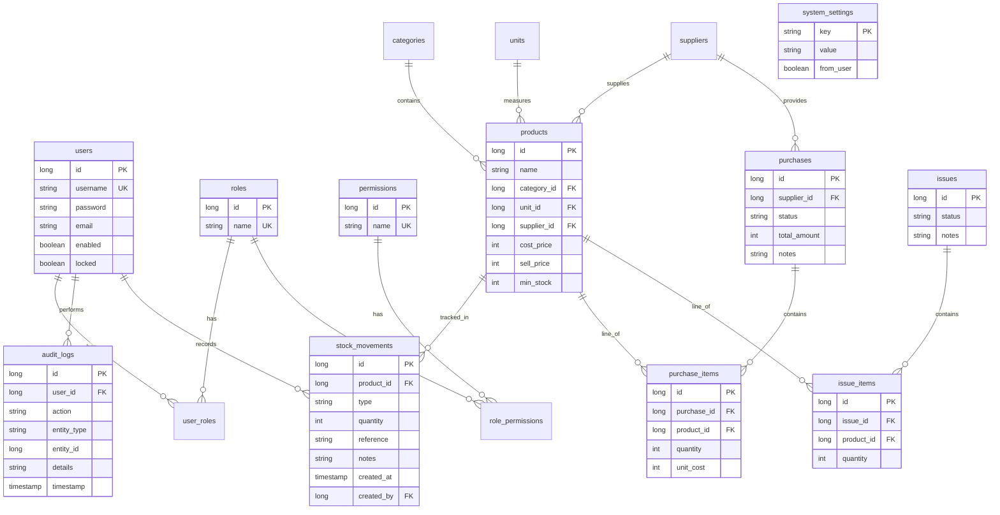

---

## API Reference

All endpoints prefixed with `/api`. Auth via `Authorization: Bearer <token>`.

### Authentication

| Method | Endpoint | Auth | Description |
|--------|----------|------|-------------|
| `POST` | `/api/auth/login` | No | Login, returns JWT |
| `GET` | `/api/health` | No | Health check |

### Core Resources

| Method | Endpoint | Permission | Description |
|--------|----------|-----------|-------------|
| `GET/POST/PUT/DELETE` | `/api/products` | Varies | Product CRUD |
| `DELETE` | `/api/products/{id}/permanent` | ADMIN | Permanent delete |
| `GET/POST/PUT/DELETE` | `/api/categories` | Varies | Category CRUD |
| `GET/POST/PUT/DELETE` | `/api/units` | Varies | Unit CRUD |
| `GET/POST/PUT/DELETE` | `/api/suppliers` | Varies | Supplier CRUD |

### Stock

| Method | Endpoint | Permission | Description |
|--------|----------|-----------|-------------|
| `GET` | `/api/stock` | VIEWER+ | Stock levels |
| `POST` | `/api/stock/in` | EMPLOYEE+ | Stock in |
| `POST` | `/api/stock/out` | EMPLOYEE+ | Stock out |
| `POST` | `/api/stock/adjust` | MANAGER+ | Adjustment |
| `GET` | `/api/stock/movements` | VIEWER+ | Movement history |

### Purchases & Issues

| Method | Endpoint | Permission | Description |
|--------|----------|-----------|-------------|
| `GET/POST/PUT` | `/api/purchases` | Varies | Purchase CRUD |
| `POST` | `/api/purchases/{id}/receive` | MANAGER+ | Receive (increases stock) |
| `POST` | `/api/purchases/{id}/cancel` | MANAGER+ | Cancel |
| `GET` | `/api/purchases/{id}/export` | VIEWER+ | Export PDF invoice |
| `GET/POST/PUT` | `/api/issues` | Varies | Issue CRUD |
| `POST` | `/api/issues/{id}/approve` | MANAGER+ | Approve |
| `POST` | `/api/issues/{id}/complete` | MANAGER+ | Complete (deducts stock) |

### Reports, Users, Settings, Backups

| Method | Endpoint | Permission | Description |
|--------|----------|-----------|-------------|
| `POST` | `/api/reports/{type}` | VIEWER+ | Generate report |
| `GET` | `/api/reports/files/{name}` | VIEWER+ | Download report |
| `GET/POST/PUT/DELETE` | `/api/users` | ADMIN | User management |
| `GET` | `/api/settings` | VIEWER+ | Get settings |
| `PUT` | `/api/settings/{key}` | ADMIN | Update setting |
| `GET/POST` | `/api/backups` | Varies | Backup management |
| `POST` | `/api/backups/{id}/restore` | ADMIN | Restore backup |

---

## Security

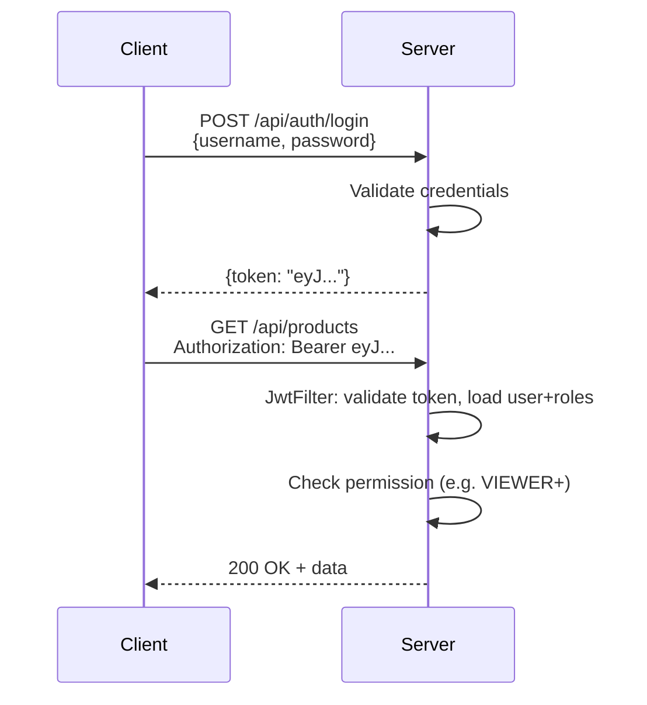

| Measure | Implementation |
|---------|---------------|
| Passwords | BCrypt hashing |
| Sessions | Stateless JWT (30 min expiry) |
| Network | Binds to `127.0.0.1` only |
| JWT Secret | Auto-generated per install |
| Audit | Every mutation logged |
| Lockout | Configurable failed attempt threshold |

---

## Testing

```bash
cd backend

# Run all tests
mvn test

# Specific tests
mvn test "-Dtest=MoneyTest"
mvn test "-Dtest=InventoryServiceConcurrencyTest"
mvn test "-Dtest=PurchaseLifecycleTest"
```

| Test | What It Proves |
|------|---------------|
| **MoneyTest** | Integer cents arithmetic — no floating-point drift |
| **ConcurrencyTest** | 10 threads race to oversell — exactly available qty sold, rest rejected |
| **PurchaseLifecycleTest** | Full workflow: create → receive → stock increased |

---

## Troubleshooting

| Problem | Solution |
|---------|----------|
| Port 8475 busy | Close other instance or set `INVENTORY_PORT` |
| SQLITE_BUSY | Close all other app instances |
| White screen in Electron | Wait 5s and relaunch; check logs |
| Forgot admin password | Another ADMIN resets it, or restore from backup |
| 422 on POST (PowerShell) | Use `cmd /c curl` or test in browser |
| PDF reports empty | Set `company.name` in Settings |

**Logs:** `backend/logs/application.log` and `backend/desktop-backend.log`

---

## Deployment

1. Build the portable package on a dev machine
2. Copy `dist\InventoryManager\` to the target machine
3. Double-click `start.cmd`
4. Login with `admin` / `admin@omar.com`
5. Change the admin password
6. Configure company name, categories, units, suppliers

**Backup strategy:**

| Frequency | Type | Retention |
|-----------|------|-----------|
| Daily 02:00 | Automatic | 30 days |
| On-demand | Manual | Until deleted |
| Before restore | Safety | Until next safety |

---

## License

This project is proprietary software. All rights reserved.
